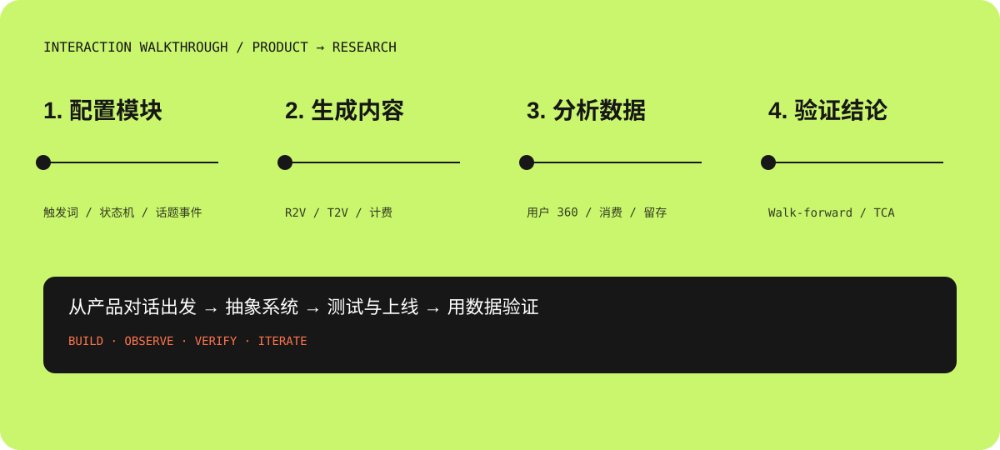
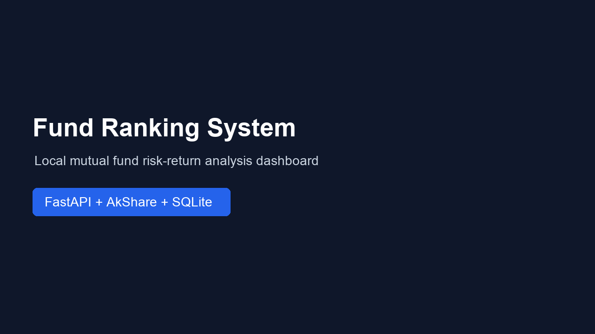
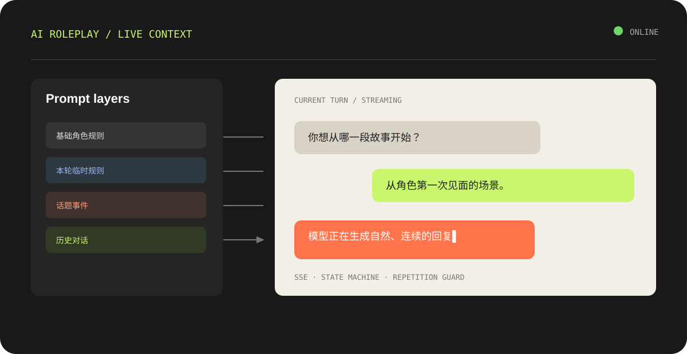
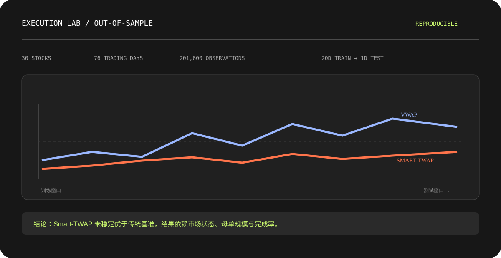
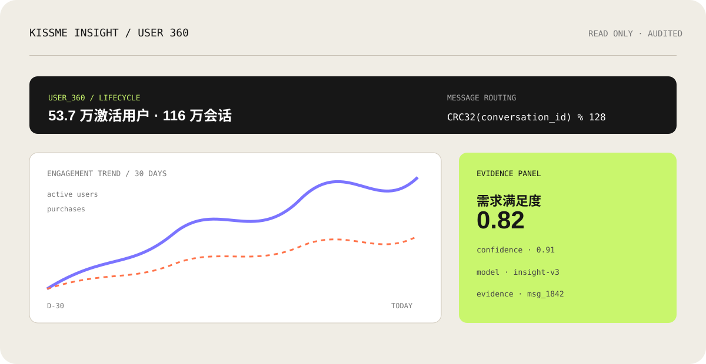
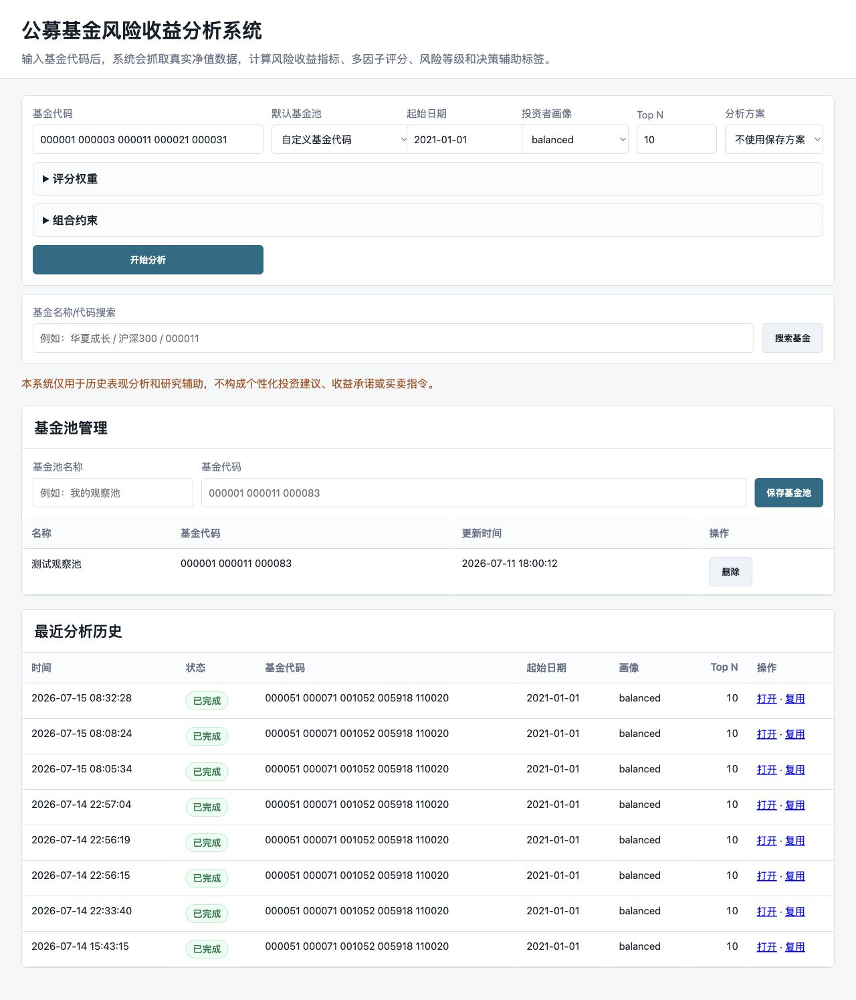
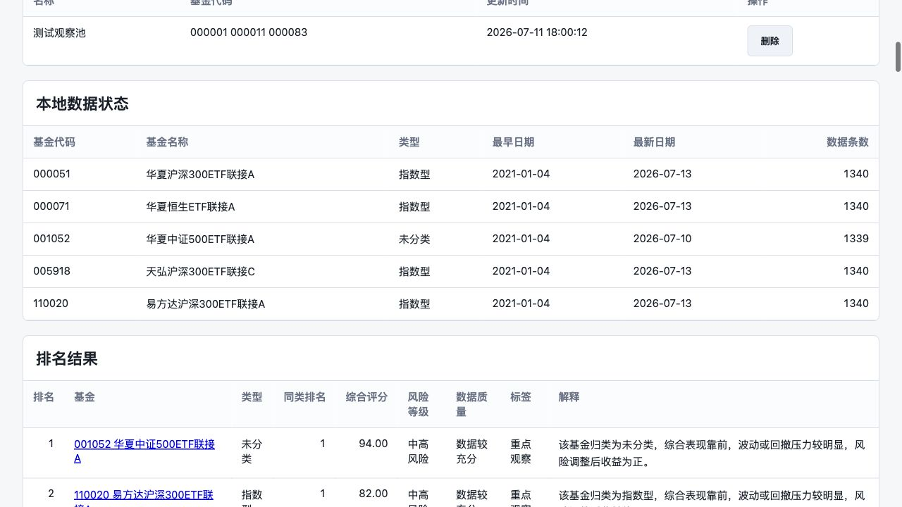
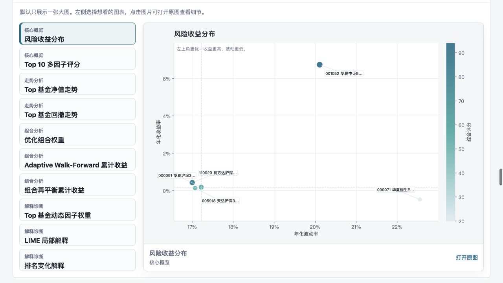

# ZZJ · 作品集

> AI 产品工程 · 数据平台 · 全栈开发 · 金融量化研究

我擅长把复杂业务问题拆解成可运行、可验证、可持续迭代的系统：从 AI 对话模块、视频生成工具，到数据洞察后台、完整 AI 产品，再到基金研究和机构交易执行实验。



> 上图展示从“配置模块 → 生成内容 → 分析数据 → 验证结论”的工作流。仓库首页直接呈现项目图、文字简介和动态交互演示，无需跳转到其他页面。

<p align="center"><a href="https://github.com/ZZJ1977/portfolio"></a>   </p>

## 浏览网页 Demo

👉 [打开作品集网页 Demo](./index.html)

### 真实操作演示（README 内直接播放）

下面是基金筛选系统的真实产品录屏：从输入基金、选择风险画像，到生成排名、查看图表和导出分析结果。这个演示比静态流程图更能体现实际交互体验。



<details>
<summary>查看视频说明</summary>

GIF 来自基金筛选系统的真实 Web Demo；完整作品集网页交互仍保留在仓库中的 `index.html`。

</details>

本地预览：`python3 -m http.server 4173`，访问 <http://localhost:4173>。

## 我的项目路径

```text
AI 交互模块 → 产品工具 → 管理后台 → 数据洞察后台 → 完整 AI 产品 → 算法与量化研究
```

---

## 01 · AI 角色扮演平台

**项目类型：** 全栈开发 / AI 交互系统



**技术栈：** React、TypeScript、FastAPI、PostgreSQL、SSE、OpenRouter、Anthropic、DeepSeek

负责 AI 角色配置、提示词模块、状态机和聊天交互开发。实现多角色 CRUD、拖拽排序、触发词、状态栏、状态机、话题事件和世界书关键词匹配。根据多轮对话分析模型提示词读取顺序，将基础规则、本轮临时规则、历史对话和用户输入分层处理，解决规则互相覆盖与上下文裁剪问题。针对模型跨轮次重复表达，设计重复短语检测、动态多样性提示、相似度检测和重复段落清理。后端完整测试达到 **85 passed**。

## 02 · DanceVideo AI 多模态生成平台

**项目类型：** 后端开发实习 / AI 产品工具


**技术栈：** Python、FastAPI、PostgreSQL、SQLAlchemy、Alembic、Pytest、Redis、FFmpeg、Docker、BytePlus Ark、DashScope、Railway、Cloudflare R2

负责 AI 视频、图片、文本和图生文模型调用链路。统一处理任务状态、usage、Token、生成数量、视频时长、分辨率和任务耗时。设计统一计费服务，使用 Decimal 计算金额，保存模型、Token、单价、币种和任务时长等明细；通过 Alembic 完成数据库迁移，并以 Pytest 覆盖未知模型、缺失 usage 和异常任务。参与短剧流程重构，梳理项目设定、AI 剧本、角色/场景资产和分镜视频的关系；围绕 T2V、I2V、R2V 的价格、输入要求和效果差异，确定短剧采用 R2V，并设计无参考素材时的 T2V 回退逻辑。

## 03 · Face Mosaic 视频隐私处理工具

**项目类型：** 独立全栈项目 / 计算机视觉工具



**技术栈：** Next.js、TypeScript、FastAPI、Python、OpenCV、CenterFace、Norfair、FFmpeg、PostgreSQL、Cloudflare R2、Google OAuth

独立推进视频自动人脸打码工具。针对运动视频中的漏脸、遮罩漂移和马赛克抖动，对比逐帧检测与跨帧跟踪方案，采用 CenterFace + Norfair、短时漏检补帧和场景切换重检。实现视频上传、URL 导入、异步任务、实时进度、原片/结果预览、下载、用户级隔离、崩溃恢复和 R2 重试，并设计与 DanceVideo 的接口，使处理结果可以回写原有素材库。

## 04 · DanceVideo AI 短剧生产工具

**项目类型：** 产品工具开发 / AI 内容生产流程


**技术栈：** Next.js、TypeScript、FastAPI、Python、PostgreSQL、Redis、FFmpeg、Docker、GitHub Actions、Railway、Cloudflare Workers

参与 DanceVideo 从单一视频生成工具向完整短剧生产工具的重构。根据产品讨论，梳理“项目设定 → AI 剧本 → 分集内容 → 角色/场景/道具/封面 → 分镜 Clip 视频”流程，参与 AI 剧本生成、分集拆分、资产复用、参考媒体校验、视频转码、审核资产库和生成历史管理。分析不同模型的输入方式、价格、分辨率、时长和连续性，推动短剧视频生成统一采用 R2V，并处理模型切换、加载速度和线上部署问题。

## 05 · KissMe 管理后台

**项目类型：** 企业级管理后台 / 存量系统维护

**技术栈：** Vue、Java、Spring Boot、MyBatis-Plus、MySQL、Redis、Jeecg-Boot、Maven、Docker

负责存量后台的功能维护、代码分析和线上问题排查。参与 Online 表单、图表、组合报表、表达式计算、动态数据源、字段级上传、卡片翻译、多应用配置和动态主题等功能。处理登录白名单、角色切换卡死、接口超时、界面中文化、Excel 数据异常和图表展示问题，逐步梳理低代码配置、前端路由、Java 接口与数据库之间的实现路径。

## 06 · KissMe Insight 数据洞察后台

**项目类型：** 数据分析后台 / 用户与经营洞察



**技术栈：** React、TypeScript、Vite、Tailwind CSS、ECharts、FastAPI、Python、MySQL、Redis、Docker

负责用户 360、聊天记录、角色偏好、消费趋势、购买分析和会话语义分析的设计与开发。分析生产数据库中用户、会话、消息分片、订单和消费账本的关系；针对约 **4,190 万条消息、128 张分片表**，设计先查询会话、再通过 `CRC32(conversation_id) % 128` 定位消息表的读取方案。参与翻译、摘要、意图和需求满足度分析，强调 AI 结果必须显示置信度、模型版本和原文证据。针对翻译和语义分析响应慢的问题，改造成后台任务、缓存和轮询机制，并建立只读访问、SQL 防护、敏感访问审计和 Schema 契约校验。

## 07 · Lumina AI 多模态内容平台

**项目类型：** 全栈开发 / 完整 AI 产品


**技术栈：** Next.js、React、TypeScript、Tailwind CSS、FastAPI、Python、SQLAlchemy、PostgreSQL、Redis、Docker、GitHub Actions、Cloudflare Workers

参与 AI 角色与 UGC 多模态内容平台的需求分析、技术方案、数据建模和前后端开发。梳理 Identity、Character、Chat、Bond、Content、Social、Async 七个业务域，参与设计 **24 张核心数据表**。建设角色创作、聊天、图片/视频生成、推荐场景和每日指标聚合，接入 DeepSeek、Claude、通义万相、豆包和 Seedance，参与统一 AIRouter 设计。推动用户侧主站和管理后台拆分，参与 OAuth、角色/内容管理、Docker 构建、自动化部署和线上问题排查。

## 08 · ARC-AGI-3 Kaggle 混合智能体系统

**项目类型：** AI 算法工程 / 视觉-符号智能体

**技术栈：** Python、OpenCV、NumPy、Jupyter、VLM、Kaggle、Pytest

围绕 ARC-AGI-3 构建视觉感知、状态理解、动作规划和结果评估组成的混合智能体。实现结构化感知、帧差检测、对象运动识别、状态图、候选规则、主动探索、符号规划、VLM 顾问和策略路由。建立 JSONL 轨迹记录和离线回放评估，针对优化后分数下降的问题，排查提交链路、跨游戏缓存污染和未经验证策略覆盖稳定路线等原因。通过缓存隔离、保守路由、异常降级和提交文件校验提升可靠性，本地完成 **25 个公开游戏无崩溃运行**，LS20 达到 **7/7、321 步**。

---

# 金融与量化研究

## 09 · 公募基金风险收益评价系统

**技术栈：** Python、Pandas、NumPy、AkShare、FastAPI、SQLite、Scikit-learn、Matplotlib、Docker







围绕“基金筛选不能只看历史收益率”，构建真实净值抓取、风险收益指标、多因子评分和 Web 分析系统。计算收益、波动、最大回撤、Sharpe、Calmar 和滚动稳定性，设计 aggressive、balanced、conservative 三类评分画像。参与基金池准入、A/C 份额去重、风险标签、因子贡献、Spearman 相关性、LIME 局部解释、机器学习辅助权重、Walk-Forward 样本外验证和组合约束。在 100 只真实基金候选池中筛选 55 只验证，并明确区分历史评价与未来收益预测。

## 10 · A 股市场风格与指数增强超额研究

**技术栈：** Python、Pandas、NumPy、AkShare、东方财富接口、SciPy、Matplotlib

围绕 A 股市场风格切换、指数分化和指数增强超额来源建立可复现研究工程。获取沪深 300、中证 500、中证 1000、科创创业 50和中证 2000 等指数行情，完成数据清洗、收益率、累计收益、相对超额、滚动相关性、滚动 Beta、风格分化和市场风格压力指标。按不同压力状态观察未来 20、60、120 个交易日的相对超额表现，并输出 CSV、图表和 Markdown 报告。

## 11 · 机构交易执行算法实验平台

**技术栈：** Python、Pandas、NumPy、Scikit-learn、BaoStock、Streamlit、Pytest、Matplotlib


将证券实习中接触到的机构大单执行问题转化为可运行、可验证的研究系统。围绕 TWAP、VWAP、POV、Smart-TWAP、母单拆分、分钟级撮合、市场冲击、Implementation Shortfall、机会成本和完成率建立实验框架。使用“20 日训练、下一日测试”的滚动样本外方法，发现 Smart-TWAP 使用全天信号归一化造成前视偏差，随后重构为基于剩余数量和剩余时间的因果分配，并增加回归测试。在 **30 只股票、76 个交易日、5 档母单规模、买卖双向和 3 档冲击场景**下生成 **201,600 条实验记录**，使用股票-交易日聚类 Bootstrap 计算置信区间。最终发现 Smart-TWAP 并未稳定优于 VWAP/TWAP，其表现受市场状态、波动率、母单规模和完成率影响。

## 核心技术栈

| 方向 | 技术 |
| --- | --- |
| 编程语言 | Python、TypeScript、Java、SQL |
| 前端 | React、Next.js、Vue、Vite、Tailwind CSS |
| 后端 | FastAPI、Spring Boot、SQLAlchemy、MyBatis-Plus、REST、SSE |
| 数据库 | PostgreSQL、MySQL、SQLite、Redis、ClickHouse |
| AI 与多媒体 | OpenRouter、DeepSeek、Claude、Seedance、Seedream、OpenCV、FFmpeg |
| 数据分析与量化 | Pandas、NumPy、Scikit-learn、AkShare、BaoStock、Walk-Forward、TCA、Bootstrap |
| 工程部署 | Docker、Railway、Cloudflare、GitHub Actions、Kaggle、Pytest |

## 我的工作方式

**先把问题说清楚：** 从用户对话、现有代码和数据结构中找出真实约束，再决定技术方案。  
**让复杂性有边界：** 把模型、数据、任务、权限和展示拆开，让每一层都能独立验证。  
**用证据交付：** 测试、日志、样本外验证、审计记录和可回溯报告，都是产品的一部分。

## 联系

- GitHub：[@ZZJ1977](https://github.com/ZZJ1977)
- 作品集 Demo：[index.html](./index.html)
